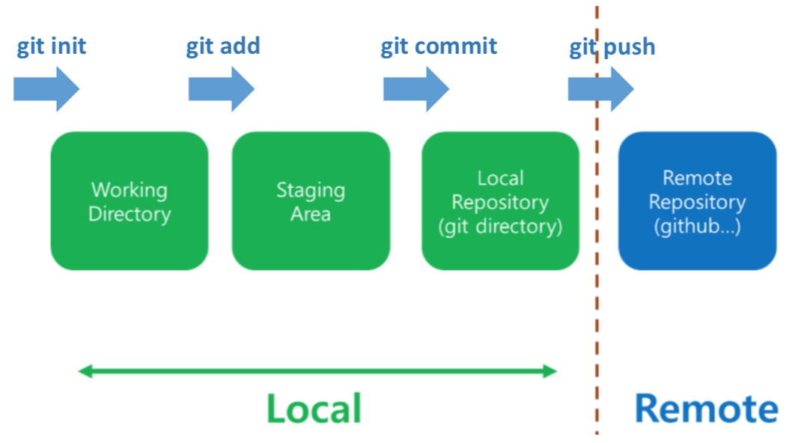
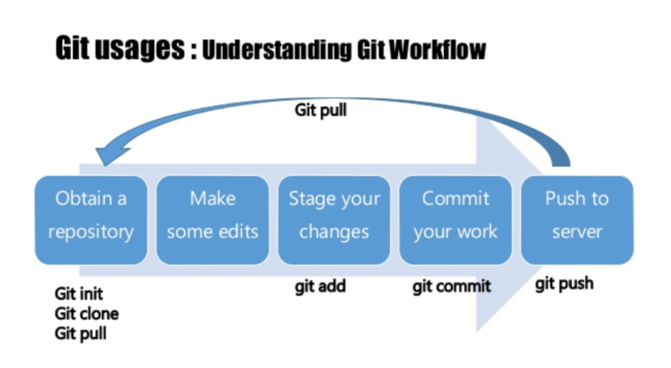
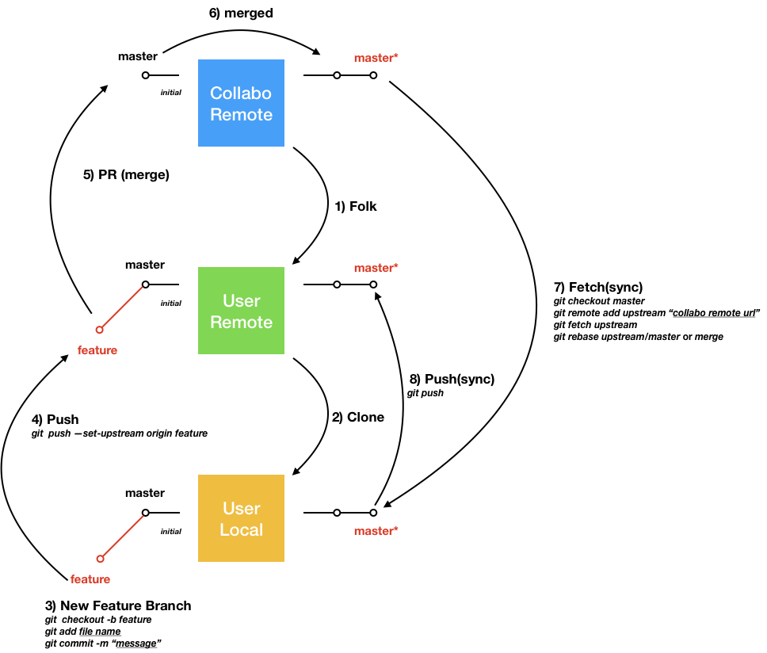

### Intro

---

**Version Control(VCS)**

- 파일의 변화를 시간에 따라 기록하여 특정 시점의 버전을 다시 불러올 수 있는 시스템
- ex) Git, Mercurial ... 

**Git**

- 개발과정, 소스파일 등을 버전별로 관리할 수 있는 도구

- 히스토리 관리를 통해 개발 과정, 역사를 시간의 흐름을 기준으로 볼 수 있으며 특정 시점으로 복구가 가능

- **분산 버전 관리 시스템**

**Github**

- Git이라는 도구를 응용할 때 필요한 원격 저장소 사이트

- 각족 원격 저장소들의 집합


### Workflow

---







```
git init 
git add <file name / directory name>
git commit -m "<commit message>"
git remote add origin <remote repository URL>
git push -u origin master
```

- `git init`
  - 현재 디렉토리를 Working Directory로 지정. 일어나는 작업들을 추적하겠다는 의미로 초기화

- `git add <file name / directory name>` 
  - 추적되고 있지 않는 파일들을 스테이지에 올려 추적, 관리 시작
  - `git status`를 통해 현재 상태 확인 가능 (*Untracked*, *modified*)

- `git commit -m "<commit message>"` 
  - 변경 사항을 메시지와 로컬 저장소에 적용
  - `git log`를 통해 커밋 로그들을 확인할 수 있다.

- `git remote add origin <remote repository URL>`  
  - 주어진 URL의 원격 저장소를  `origin` 이라는 이름으로 등록 

- `git push -u origin master` 
  - `origin` 원격 저장소의 `master` 브랜치에 작업 사항을 동기화


### Collaborate

---

**Flow**

일반적으로 오픈소스에 기여를 하거나 협업을 진행할 때 볼 수 있는 전체적인 흐름을 나타낸 다이어그램이이다. (방법은 여러가지가 있다.)




1. 먼저 기여할 혹은 협업할 저장소(이하 `Collabo Remote`)를 자신의 깃헙 계정 저장소로 **folk**를 한다.
2. 자신의 깃헙 계정에 folk된 저장소(이하 `User Remote`)를 자신의 PC로 **clone**을 진행한다. 
3. PC로 클론한 프로젝트(이하 `User Local`)에서 추가하고 싶은 혹은 자신이 담당할 기능에 대한 브랜치를 생성 (`feature`)하고 그곳에서 코드 작성을 진행한다. 
4. 새로운 기능을 담고 있는 `feature` 브랜치를 `User Remote` 저장소로 **push**한다. 
5. `User Remote`에 올라간 `feature` 브랜치를 `Collabo Remote`의 `master`(혹은 다른 브랜치) 병합을 요청한다. (**Pull Request, PR**)
   1. 코드 리뷰가 진행된다. 
   2. 코드의 수정이 필요하다면 계속해서 `feature` 브랜치에 수정 사항을 반영한다.
6. 병합(**Merge**)가 되면 이제 `Collabo Remote`의 `master` 브랜치는 새로운 기능이 추가된 최신 상태가 되었다. 
7. 이제 이러한 `master` 브랜치의 최신 상태(*`feature` 브랜치의 내용이 반영된*)를 `User Local`, `User Remote`에도 반영해주어야 한다. 먼저 `User Local`로 최신 변경 사항을 가져와 이전 상태와 병합을 진행한다. 
8. 그리고 최신의 상태를 유지하고 있는 `User Local`의 `master` 브랜치를 `User Remote`로 **push**하여 `User Remote` 역시 최신 상태로 갱신한다. 

> 이와 같은 내용을 담고 있는 코드스쿼드의 [Git 강좌](https://youtu.be/CbLNbCUsh5c)


### Git Advanced

---

**커밋 되돌리기**


우리는 워킹 디렉토리에서 작업을 진행한다. 그리고 변경이 된 부분을 **Staging Area(INDEX)**로 올린다 (`git add <file name>`). 이러한 작업을 **스테이징(Staging)**, 혹은 **인덱스에 등록**이라 표현한다. 그리고 **변경을 확정**짓고 **로컬 저장소에 이를 반영**하는 것이 **커밋(Commit)**(`git commit -m "<message>"`)이다. 

파일의 변경부터 스테이징, 커밋까지 단계적으로 진행된다는 것을 기억하고 **커밋 되돌리기**에 대해 알아보자


**`git commit --amend`**

`--amend` 옵션을 통해 현재 브랜치 상에서 가장 **최신의 커밋 메시지를 수정**할 수 있다. 

```bash
git commit -m "first commit"
git log

-------------------------
commit 7cfe3a84320be33250cbaece193d3289e9n0e3cb (HEAD -> master)
Author : author
Date: date 
	first commit 
-------------------------

git commit --amend -m "Add sample.txt"
git log

-------------------------
commit 591620e9bd73ab97f380293103cd719913645csd (HEAD -> master)
Author : author
Date: date 
	Add sample.txt
-------------------------
```


**`git reset <option> <commit ID>`**

시간을 되돌리듯이 커밋을 당시로 돌려놓는다. 옵션의 대표적이 세 가지는 다음과 같다. 

- `--hard`
  - 돌아가려는 커밋 이후의 모든 작업 디렉토리와 인덱스 모두 유지하지 않고 이전 커밋으로 `HEAD`를 되돌림
  - **작업하던 내용을 의도적으로 모두 삭제**하고자 할 때만 사용

- `--soft`
  - 현재 인덱스 상태와 작업 디렉토리 내용을 그대로 보전한 채 **커밋만 되돌릴 경우 사용**.
  - `git add` 까지 진행한 상태
  - 바로 커밋을 할 수 있는 상태
- `--mixed`
  - 모든 **작업 디렉토리는 유지**하면서 **인덱스를 `HEAD`와 함께 돌아가고자 하는 커밋으로 돌아감**
  - 변경 사항을 적용하려면 먼저 `git add`를 해서 인덱스에 올려야 함.
  - **디폴트 옵션**


이렇게 보면 와닿지 않을 수 있다. 직접 명령어를 하나씩 타이핑하면서 이를 익혀보자. 현재 마크다운 파일의 상태는 다음과 같이 제목만 작성된 상태이다. 

```markdown
### TODO
```

여기에 첫 번째 해야할 일을 입력하고 이를 커밋해보자.

```markdown
### TODO

1. 후쿠오카 교통 패스 구매하기
```

```bash
git add todo.md
git commit -m "Buy Pass"
git log

-------------------------
commit 9ee7ba2504e3ebaaf5e622ae5701c5aa455b97e4 (HEAD -> master)
Author: author <author@gmail.com>
Date:   Sat Jan 26 19:45:11 2019 +0900
	Buy Pass
	
commit 28794fbf3a48c316f1b409872fa4490a287998ca
Author: author <author@gmail.com>
Date:   Sat Jan 26 19:40:23 2019 +0900
	Title TODO
-------------------------
```

**먼저 `--hard` 옵션을 사용해보자.** 우리는 제목을 작성한 시점으로 돌아가려 한다. 해당 커밋의 아이디는 `28794fbf3a48c316f1b409872fa4490a287998ca`이다. 

```bash
git reset --hard 28794fbf3a48c316f1b409872fa4490a287998ca
git log

-------------------------
commit 28794fbf3a48c316f1b409872fa4490a287998ca (HEAD -> master)
Author: author <author@gmail.com>
Date:   Sat Jan 26 19:40:23 2019 +0900
	Title TODO
-------------------------
```

로그를 확인해보면 `HEAD`가 원하는 커밋 시점으로 돌아간 것을 확인할 수 있다. 그러면 파일을 열어 확인해보자. 

```markdown
### TODO
```

변경 사항까지 모두 사라진 것을 확인할 수 있다. 그리고 `git status`를 통해 파일들의 상태를 보면 모든 것이 최신이고 변경 사항이 없다는 문구를 확인할 수 있다. 즉 돌아오고자 했던 커밋 이후의 모든 사항들은 삭제된 것이다. 

` git reset --hard ORIG_HEAD` 명령어를 통해 `reset` 내역을 취소하고 원 상태로 돌아가보자. ("Buy Pass" 커밋으로)

**이번엔 `--soft` 옵션을 사용해보자.** 동일하게 제목을 작성한 시점으로 돌아가보자.

```bash
git reset --soft 28794fbf3a48c316f1b409872fa4490a287998ca
git log

-------------------------
commit 28794fbf3a48c316f1b409872fa4490a287998ca (HEAD -> master)
Author: author <author@gmail.com>
Date:   Sat Jan 26 19:40:23 2019 +0900
	Title TODO
-------------------------

git status

-------------------------
On branch master
Changes to be committed:
  (use "git reset HEAD <file>..." to unstage)

	modified:   todo.md
-------------------------
```

커밋 로그를 보면 `HEAD`가 제목 생성 시점으로 옮겨진 것을 확인할 수 있다.

```markdown
### TODO

1. 후쿠오카 교통 패스 구매하기
```

하지만 파일을 열어보면 변경 사항을 인덱스로 올린 상태를 유지하고 있는 것을 확인할 수 있다. 변경을 했던 부분은 유지가 되어 인덱스에 올라가 있지만 아직 이를 확정짓지 않은 상태이다. 여기서 커밋을 통해 변경 사항을 확정 지을 수 있다.


